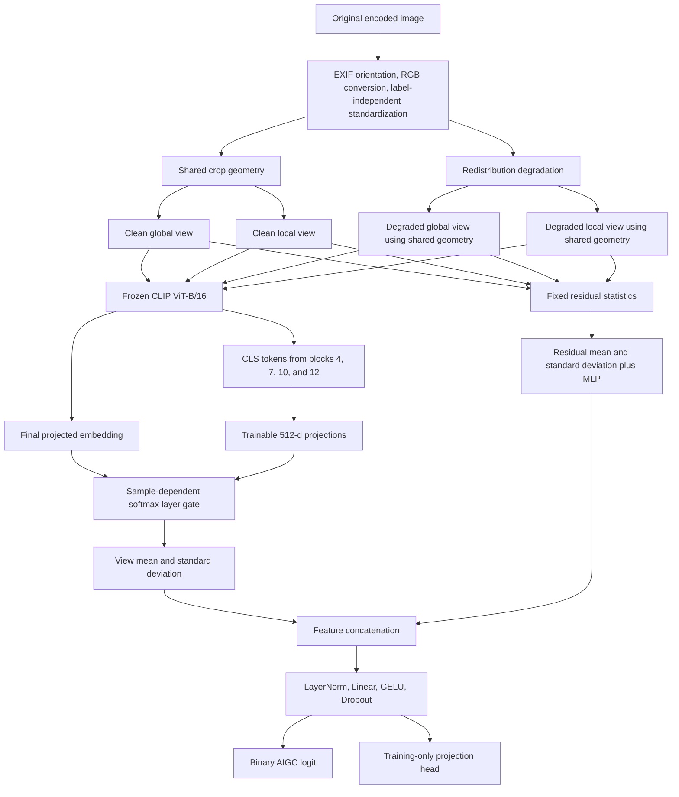

# RobustFake

[GitHub](https://github.com/ParrotG/RobustFake) · [Hugging Face Model](https://huggingface.co/ParrotG/RobustFake)

## Problem and Solution

Generative image systems can produce realistic synthetic media at scale, while ordinary redistribution operations—JPEG recompression, blur, resizing, noise, colour adjustment, and cropping—can erase or alter the traces used by image-forensics detectors. The challenge is therefore not merely to separate clean AI-generated and authentic images, but to preserve reliable ranking and control false positives after content has passed through realistic sharing pipelines. The detector must also remain practical at hackathon scale and stay below the 2-billion-parameter limit.

RobustFake addresses this problem with a frozen CLIP ViT-B/16 visual encoder and a compact trainable forensic head. It combines global context with local evidence, fuses semantic and intermediate transformer representations, incorporates fixed residual statistics, and trains on paired clean/degraded views whose spatial geometry is shared. A diverse, leakage-audited training pool and separate in-distribution/domain-generalisation validation roles reduce dependence on a single generator or real-image source. Post-training affine calibration corrects global confidence bias without changing the detector ranking or using the official demonstration set for fitting.

### Project Snapshot

| Category | Selection |
|---|---|
| Development environment | Visual Studio Code; Python command-line workflow |
| Model | Frozen OpenCLIP `ViT-B-16-quickgelu/openai`; trainable multi-layer fusion and binary detection heads; residual-statistics branch enabled by default |
| Core libraries and frameworks | PyTorch, torchvision, OpenCLIP, Pillow, scikit-learn, NumPy, Hugging Face Hub, PyArrow, ModelScope Hub |
| Training datasets | Shanmuk AI Image Detection Dataset, WildFake train split, Community Forensics-Small, Tiny-GenImage |
| Official demonstration dataset | WildFake subset: COCO val2017 real images and DALL·E Advanced generated images |
| Scale | 80,000 prepared images; 64k train, 8k ID validation, 8k domain-generalisation validation |
| Compute profile | Frozen backbone; fewer than 5M trainable parameters; approximately 8–12GB NVIDIA GPU memory recommended |


## Contents

- [RobustFake](#robustfake)
  - [Problem and Solution](#problem-and-solution)
    - [Project Snapshot](#project-snapshot)
  - [Contents](#contents)
  - [Model Design](#model-design)
    - [Frozen multi-layer visual representation](#frozen-multi-layer-visual-representation)
    - [Training objective](#training-objective)
  - [Dataset Design](#dataset-design)
  - [Training, Validation, and Calibration](#training-validation-and-calibration)
    - [Paired robustness augmentation](#paired-robustness-augmentation)
    - [Optimisation profile](#optimisation-profile)
    - [Validation and checkpoint selection](#validation-and-checkpoint-selection)
    - [Global calibration](#global-calibration)
  - [Official Evaluation](#official-evaluation)
    - [External academic baselines](#external-academic-baselines)
  - [Ablation Protocol](#ablation-protocol)
  - [Environment and Reproduction](#environment-and-reproduction)
    - [Environment requirements](#environment-requirements)
    - [Installation](#installation)
    - [Required directory-to-JSON inference](#required-directory-to-json-inference)
    - [Evaluation with the Hugging Face model](#evaluation-with-the-hugging-face-model)
    - [Training reproduction](#training-reproduction)
  - [Robustness Evaluation Summary](#robustness-evaluation-summary)
  - [Error Analysis Note](#error-analysis-note)
  - [Limitation Reflection](#limitation-reflection)
  - [Team Contribution](#team-contribution)

## Model Design

### Frozen multi-layer visual representation

The visual backbone is OpenCLIP `ViT-B-16-quickgelu/openai`. The text encoder is discarded, all visual-encoder parameters remain frozen, and the backbone is kept in evaluation mode. This preserves the broad semantic representation learned by CLIP while keeping training and checkpoint size appropriate for the available compute budget.

Each image is rendered as two square views:

- A global view covering 90%–100% of the shorter image dimension retains scene-level context without exposing label-correlated letterbox padding.
- A local view covering 50%–90% of the shorter dimension increases the chance of observing spatially local synthesis artifacts.

For each view, the detector extracts the final 512-dimensional projected CLIP embedding and normalized CLS tokens from transformer blocks 4, 7, 10, and 12. Trainable linear projections map the intermediate tokens to 512 dimensions. A sample-dependent softmax gate then combines the final semantic representation with intermediate evidence instead of assigning every layer a fixed importance.

The fused global and local embeddings are aggregated with their mean and standard deviation. The mean represents evidence shared by both views; the standard deviation exposes disagreement between global context and local detail. This aggregation is invariant to view ordering.

The residual-statistics branch, enabled by default, computes 24 fixed high-pass statistics per view from directional residuals, channel-wise Laplacians, and horizontal/vertical pixel differences. Its view-wise mean and standard deviation pass through a small MLP and are concatenated with the CLIP aggregate. This gives the detector direct access to compact forensic evidence while leaving the CLIP backbone frozen.



At inference time, only one clean global/local pair is required. The clean/degraded branches shown above are paired training views.

### Training objective

Clean and degraded views of the same image reuse exactly the same crop geometry, so the consistency term measures sensitivity to redistribution artifacts rather than sensitivity to different image regions.

```text
L = 1.0 × mean(BCEclean, BCEdegraded)
  + ramp(epoch) × 0.5 × SmoothL1(sigmoid(logitdegraded), stop_gradient(sigmoid(logitclean)))
  + 0.05 × supervised_contrastive_loss
```

- Binary cross-entropy teaches the classifier on both untouched and redistributed inputs.
- Probability-space consistency uses the clean prediction as a bounded teacher target. Its one-epoch ramp prevents an abrupt regularisation change at the start of optimisation without allowing unbounded logit distances to dominate later training.
- Supervised contrastive learning brings clean/degraded projections with the same real/fake label closer while separating opposing labels.

The final feature head is `LayerNorm → Linear → GELU → Dropout`, followed by a one-logit classifier. Runtime checks enforce the challenge's parameter limit and cap the trainable detector components below 5M parameters.

## Dataset Design

The training pool is designed to represent variation along two different axes: how authentic images are acquired and what type of generator produces synthetic images. Authentic content includes photographic, web-scale, face, landscape, and ImageNet/COCO-like sources. Synthetic content spans diffusion, GAN, autoregressive/other families, general-purpose generators, fine-tuned community models, and multiple generation resolutions. This diversity is intended to make the decision boundary less dependent on one benchmark's content style or one generator family.

| Source | Role in the mixture |
|---|---|
| Shanmuk paired set | Provides controlled real/generated pairs and modern diffusion coverage |
| WildFake train split | Broadens real domains and introduces multiple generator families and architectures |
| Community Forensics-Small | Adds large-scale community fine-tunes, commercial systems, and heterogeneous web content |
| Tiny-GenImage | Adds compact coverage of established GAN and diffusion benchmarks |

The physical pool contains 40,000 real and 40,000 generated images. Source quotas prevent a large repository from replacing the intended mixture. Within each quota, real samples are bucketed by acquisition/content source and generated samples by family, architecture, and model. Square-root allocation gives larger domains more examples while reducing their ability to dominate and avoiding excessive oversampling of very small buckets.

The 80,000 records are divided into:

- `train`: 64,000 class-balanced images used for optimisation.
- `val_id`: 8,000 class-balanced images from represented sources, measuring ordinary held-out generalisation.
- `val_dg`: 8,000 class-balanced images containing fully held-out real domains, generator architectures, and community model identities, measuring domain and generator transfer.

Parent groups and paired records remain within one role. Selected generators and real domains are excluded globally from training when they are assigned to domain-generalisation validation.

Duplicate and leakage control is applied before a candidate enters the manifest. The pipeline checks provenance identity, encoded content, canonical pixels, perceptual similarity, and crop-resistant similarity. Known official-evaluation assets have priority over validation and training records, same-label duplicates are replaced from deterministic reserves, and confirmed conflicting-label duplicates fail preparation. These controls make the official result a meaningful external demonstration rather than a measure of memorised images.

Preprocessing is deliberately label-independent. EXIF orientation, alpha compositing, RGB conversion, optional resize round trips, and JPEG/WebP re-encoding are applied without access to the label or source identity. This reduces reliance on acquisition format while retaining both clean and degraded branches from the same standardised base image. A separate nuisance probe audits whether simple colour, sharpness, blockiness, and frequency features can still predict the label; it is diagnostic and does not become an input to the detector.

All source revisions and critical metadata checksums are pinned. Dataset-specific licenses and upstream image restrictions remain authoritative; the combined pool is intended for non-commercial research and hackathon demonstration.

## Training, Validation, and Calibration

### Paired robustness augmentation

Every training record produces clean global/local views and a degraded global/local pair. The degraded branch samples zero, one, or two distinct operations from:

- JPEG recompression, with low-probability double JPEG;
- Gaussian blur;
- downscale/upscale with varied interpolation;
- Gaussian noise;
- brightness, contrast, and saturation changes;
- centre crop followed by resize;
- low-probability WebP recompression.

The configured ranges cover the challenge severities while also sampling intermediate values. Applying the same corruption distribution to both labels prevents “being degraded” from becoming a synthetic-image label. Sharing crop geometry between clean and degraded pairs isolates transformation sensitivity, and retaining a clean classification branch protects clean-image performance while robustness is learned.

### Optimisation profile

| Setting | Value | Motivation |
|---|---:|---|
| Epochs | 8 | Sufficient for the compact head, with early stopping |
| Micro-batch / effective batch | 64 / 64 | Stable class coverage within the available memory budget |
| Optimizer | AdamW | Standard optimisation for transformer-derived features |
| Learning rate | `1e-4` | Conservative update size for the small detection head |
| Weight decay | `1e-3` | Limits logit-scale and head overfitting |
| Warm-up | 5% of optimizer steps | Stabilises early updates |
| Schedule | Cosine decay | Smoothly reduces the learning rate |
| AMP | FP16 | Improves throughput and memory use |
| Gradient clipping | `1.0` | Guards against unstable head updates |
| Early-stopping patience | 3 epochs | Limits overfitting after validation stops improving |
| Consistency weight / ramp | `0.5` / 1 epoch | Enforces redistribution invariance after a short warm start |
| Contrastive weight / temperature | `0.05` / `0.10` | Adds class-structured representation supervision |

CLIP features can be precomputed into deterministic FP16 shards. Cached training loads only the trainable projections, gate, residual branch, and detector heads, which makes repeated head training practical without changing the mathematical objective.

### Validation and checkpoint selection

Validation transformations are deterministically seeded from the record identity so metrics are comparable across epochs. Clean and degraded metrics are reported separately on both validation roles. The checkpoint score remains intentionally simple:

```text
selection score = 0.5 × mean ID clean/degraded AUROC
                + 0.5 × mean DG clean/degraded AUROC
```

This gives equal importance to familiar held-out domains and deliberately unseen domains without tuning against the official demonstration dataset. AUROC and Average Precision measure ranking; Balanced Accuracy, F1, real recall, fake recall, and confusion counts expose threshold behavior and false-positive trade-offs.

### Global calibration

After checkpoint selection, a single affine Platt calibrator is fitted on pooled clean/degraded `val_id` and `val_dg` logits:

```text
pcalibrated = sigmoid(a × raw_logit + b)
```

The fitted intercept can correct a global real/fake confidence bias that temperature-only scaling cannot move. Threshold selection then considers `val_id_clean`, `val_id_transformed`, `val_dg_clean`, and `val_dg_transformed` separately. It protects the best clean macro Balanced Accuracy within a configured tolerance and, among eligible thresholds, maximises the worst validation-group Balanced Accuracy before using macro performance as a tie-breaker. This avoids allowing an easy or over-represented validation group to determine the operating point.

The calibration artifact is bound to the checkpoint SHA-256, is never fitted on the official demonstration set, and is automatically applied by official evaluation and directory inference when present. If compatible validation feature shards exist, calibration only runs the small detector head.

## Official Evaluation

The challenge-prescribed demonstration subset contains 4,998 COCO val2017 authentic images and 8,843 DALL·E Advanced generated images. It is isolated under `data/evaluation/`, excluded from training through the leakage deny list, and evaluated with the exact single-transform matrix requested by the challenge:

- JPEG quality: 90, 70, 50, 30;
- Gaussian blur sigma: 0.5, 1.0, 2.0;
- resize: 0.5× and 0.25× followed by upscaling;
- Gaussian noise sigma: 0.02, 0.05, 0.10;
- colour jitter within 20%;
- centre crop retaining 80%.

Additional ordered compositions are treated as stress tests and reported separately from the prescribed single transformations.

The completed official evaluation currently reports:

| Evaluation slice | AUROC |
|---|---:|
| Clean | 0.9792 |
| Mean across prescribed single transformations | 0.9683 |
| Worst prescribed single transformation | 0.9432 |
| Mean across additional composed stress tests | 0.8968 |
| Worst additional composed stress test | 0.8713 |

With the internally selected robust calibrated threshold, clean Balanced Accuracy is 0.8898. Strong blur and 0.25× resize retain AUROC 0.9469 and 0.9446 while achieving real recall 0.8824 and 0.8705 respectively. The strongest additional composed stress test remains the principal operational weakness: AUROC is 0.9168, but real recall falls to 0.6152. This separation between ranking and threshold behavior motivates reporting both AUROC and class-specific recall.

Official evaluation caches frozen final, intermediate, and residual features by preprocessing identity and scenario. The first evaluation computes CLIP features; compatible checkpoints subsequently execute only the trainable head. A deterministic `--fast` profile uses a balanced 2,000-image subset and representative severe scenarios for iteration, while the formal report always uses the complete official subset and full prescribed matrix.

### External academic baselines

The same prepared manifests and transformation scenarios can evaluate two pinned public detectors without retraining them:

- CNNDetection, the ResNet-50 `blur_jpg_prob0.5.pth` model from *CNN-generated images are surprisingly easy to spot... for now* (CVPR 2020);
- UnivFD, the OpenAI CLIP ViT-L/14 linear detector from *Towards Universal Fake Image Detectors That Generalize Across Generative Models* (CVPR 2023).

Their official checkpoints, repository revisions, preprocessing, score direction, and SHA-256 values are recorded in `baseline_evaluation`. Downloads are verified before loading. Baseline scores are deliberately reported as uncalibrated; AUROC and Average Precision are therefore the primary comparisons, while fixed-threshold metrics remain diagnostic.

```bash
uv run aigc-download-baselines --config configs/default.yaml
uv run aigc-evaluate-baselines \
  --config configs/default.yaml \
  --dataset wildfake_official \
  --fast
```

Omit `--fast` for the complete single- and composed-transformation matrix. Use repeated `--baseline cnndetection` or `--baseline univfd` arguments to select individual baselines. Results and per-image predictions are written under `artifacts/evaluations/baselines/<dataset>/<baseline>/`; checkpoint-independent scenario scores are cached separately for repeatable presentation analysis.

## Ablation Protocol

The core ablation suite starts from the final RobustFake configuration and independently removes residual statistics, multi-layer fusion, consistency loss, contrastive loss, or post-hoc calibration. All trainable ablations reuse the same frozen feature and residual caches, data split, seed, optimisation budget, checkpoint rule, and internal calibration protocol. The detailed commands, reporting rules, and presentation-ready SVG generator are documented in [docs/ABLATIONS.md](docs/ABLATIONS.md).

## Environment and Reproduction

### Environment requirements

- Python 3.10 or later;
- `uv` for dependency and environment management;
- PyTorch 2.2 or later;
- an NVIDIA GPU with approximately 8–12GB VRAM for training;
- sufficient local storage for prepared images and feature caches;
- authenticated Hugging Face access only when reproducing gated training datasets.

### Installation

```bash
git clone https://github.com/ParrotG/RobustFake.git
cd RobustFake
uv sync --extra dev
```

All runtime settings are centralised in [configs/default.yaml](configs/default.yaml). Commands accept `--config` and repeated `--set section.key=value` overrides.

The release endpoint is configured as [ParrotG/RobustFake](https://huggingface.co/ParrotG/RobustFake). After the maintainer uploads the release package, it provides the trainable checkpoint, its SHA-256-bound calibration, and the resolved training configuration, so users do not need to reproduce training before inference. A public repository does not require authentication for download.

To download the model package without running inference:

```bash
uv run robustfake-download-model \
  --config configs/default.yaml \
  --hf-repo ParrotG/RobustFake
```

### Required directory-to-JSON inference

The challenge-required CLI recursively scores supported images and atomically writes one JSON array:

```bash
uv run aigc-predict \
  --config configs/default.yaml \
  --hf-repo ParrotG/RobustFake \
  --input-dir path/to/images \
  --output-json predictions.json
```

Each output item contains exactly the required fields:

```json
{"image_path": "path/to/images/example.jpg", "pred": 0.9231}
```

`pred` is the estimated probability that the image is AI-generated. A compatible checkpoint-bound calibration file is applied automatically. Use `--no-recursive` to restrict discovery to the top-level directory.

After the first download, Hugging Face Hub reuses its local immutable snapshot cache. A local package remains supported by replacing `--hf-repo` with `--checkpoint path/to/best.pt`; place the matching `calibration.json` beside the checkpoint.

### Evaluation with the Hugging Face model

After preparing the official demonstration subset, run either the fast diagnostic or complete matrix without training:

```bash
uv run aigc-prepare-official-eval --config configs/default.yaml
uv run aigc-evaluate-official \
  --config configs/default.yaml \
  --hf-repo ParrotG/RobustFake \
  --fast
uv run aigc-evaluate-official \
  --config configs/default.yaml \
  --hf-repo ParrotG/RobustFake
```

### Training reproduction

Prepare the official protected manifest, complete the configured leakage-deny manifests as documented in [docs/PROJECT.md](docs/PROJECT.md), then prepare the mixed dataset:

```bash
uv run aigc-prepare-official-eval --config configs/default.yaml
hf auth login
uv run aigc-prepare --config configs/default.yaml
```

Cache frozen features and train the detector head:

```bash
uv run aigc-cache-features --config configs/default.yaml
uv run aigc-cache-residuals --config configs/default.yaml
uv run aigc-train \
  --config configs/default.yaml \
  --set feature_cache.use_for_training=true
```

Fit calibration and run the complete official evaluation:

```bash
uv run aigc-calibrate \
  --config artifacts/runs/your_run/resolved_config.yaml \
  --checkpoint artifacts/runs/your_run/best.pt
uv run aigc-evaluate-official \
  --config artifacts/runs/your_run/resolved_config.yaml \
  --set evaluation.checkpoint_path=artifacts/runs/your_run/best.pt
```

For a shorter diagnostic pass, append `--fast` to the evaluation command. Detailed storage, resume, and acquisition behavior is documented in [docs/PROJECT.md](docs/PROJECT.md).

## Robustness Evaluation Summary

The complete release baseline was evaluated on all 13,841 official demonstration images under every scenario. The reported operating-point metrics use the single calibration fitted exclusively on the internal validation splits; no official labels were used for checkpoint selection, calibration, or threshold fitting.

| Evaluation family | Tested settings | Mean AUROC | Worst AUROC (setting) | Lowest Balanced Accuracy |
|---|---|---:|---:|---:|
| Clean | No added degradation | 0.9792 | 0.9792 | 0.8898 |
| JPEG recompression | Quality 90, 70, 50, 30 | 0.9714 | 0.9595 (`Q=50`) | 0.8373 |
| Gaussian blur | Sigma 0.5, 1.0, 2.0 | 0.9623 | 0.9469 (`sigma=2.0`) | 0.8845 |
| Resize | Scale 0.5, 0.25 | 0.9439 | 0.9432 (`scale=0.5`) | 0.8700 |
| Gaussian noise | Sigma 0.02, 0.05, 0.10 | 0.9885 | 0.9838 (`sigma=0.10`) | 0.9395 |
| Colour adjustment and crop | Jitter 20%, crop 80% | 0.9656 | 0.9656 (`jitter=20%`) | 0.8479 |
| **All prescribed single transformations** | 14 scenarios | **0.9683** | **0.9432** (`scale=0.5`) | **0.8373** |
| Additional composed stress tests | 6 ordered pipelines | 0.8968 | 0.8713 (`crop→resize→JPEG`) | 0.7746 |

The mean prescribed-transformation AUROC is only 0.0109 below clean AUROC, and even the worst prescribed transformation remains above 0.94. Noise is handled particularly well; resizing and strong blur are the most difficult single-operation families. Ordered compositions create a larger distribution shift and should therefore be interpreted as a separate stress boundary rather than averaged into the challenge-prescribed result.

Ranking robustness does not guarantee a uniformly safe operating point. The following cases expose the principal class-specific trade-offs:

| Scenario | AUROC | Balanced Accuracy | Real recall | Fake recall | Interpretation |
|---|---:|---:|---:|---:|---|
| Clean | 0.9792 | 0.8898 | 0.9818 | 0.7978 | Strong real-image protection, with lower fake recall at the selected robust threshold |
| Blur, `sigma=2.0` | 0.9469 | 0.8845 | 0.8824 | 0.8867 | The two class recalls remain balanced under the strongest blur |
| Resize, `scale=0.25` | 0.9446 | 0.8784 | 0.8705 | 0.8864 | Severe downsampling reduces ranking but does not collapse either class recall |
| Crop 80% | 0.9656 | 0.8479 | 0.9788 | 0.7170 | Ranking remains strong, but more generated images cross the real decision side |
| Crop→blur→resize→JPEG stress | 0.9168 | 0.7746 | 0.6152 | 0.9340 | The largest observed false-positive shift under compounded degradation |

For presentation, the clearest primary visual is a set of four severity curves for JPEG, blur, resize, and noise, with AUROC on a shared `0.90–1.00` axis and clean AUROC shown as a dashed reference. A second compact panel should compare `clean`, `mean prescribed single`, `worst prescribed single`, and `mean composed` AUROC without mixing composed tests into the official aggregate. Pair this with a real-versus-fake recall dumbbell for the five representative rows above; this makes the distinction between ranking robustness and threshold robustness visually explicit.

## Error Analysis Note

<!-- Reserved for representative false positives, false negatives, and threshold trade-offs. -->

## Limitation Reflection

The mixed training and validation design broadens both authentic-image domains and generator families, but a complete leave-one-source-out study has not yet been run because of the available training time and compute budget. The held-out domains and generator architectures in `val_dg`, together with the external official evaluation, provide partial evidence of transfer to unseen conditions; they do not establish that performance will remain stable when every constituent dataset or source family is removed in turn. Source-level leave-one-out evaluation is therefore a priority for validating whether any part of the mixture remains disproportionately influential.

RobustFake deliberately focuses on evidence available in decoded image pixels. Authenticity can also be assessed through provenance and acquisition signals such as C2PA manifests, EXIF fields, content credentials, and embedded watermark detectors such as SynthID. Some of these signals may survive transformations that weaken pixel-level forensic traces and can provide stronger positive provenance when present. However, the project primarily uses established datasets because collecting a legally and demographically representative sample of real Internet media was not feasible within the project scope. Such datasets are commonly re-encoded or otherwise preprocessed, and their metadata presence, removal patterns, and platform distribution may not reflect the open Internet. Adding these channels under those conditions could teach dataset provenance rather than media authenticity. A future system should instead fuse pixel evidence with independently validated provenance while treating missing or editable metadata as inconclusive.

CLIP was selected as the visual backbone because its large-scale image-language pretraining offers broad semantic coverage, its intermediate transformer features retain information at several abstraction levels, and freezing it makes repeated robustness experiments feasible under the parameter and compute constraints. This choice is not evidence that CLIP is the optimal backbone for image forensics. Self-supervised encoders such as DINO-family models, other vision-language encoders such as SigLIP, convolutional architectures, and models pretrained specifically on forensic or frequency-domain objectives could provide useful controls or complementary evidence. Time constraints prevented a controlled backbone comparison.

The official demonstration set is also narrower than a deployment environment: its clean subset contains one principal authentic source and one principal generator source, while the applied corruptions are deterministic simulations of redistribution. Real platforms introduce content-dependent resizing, repeated transcoding, screenshots, overlays, mixed editing histories, and changing generator distributions. The additional composed scenarios probe this gap, but they are not a substitute for longitudinal evaluation on naturally circulated media.

Finally, the detector returns a binary probability rather than a provenance proof or generator attribution. The release results show that class ranking can remain strong while a fixed threshold becomes asymmetric under severe composed transformations. Calibration drift, adaptive post-processing, and newly released generators can therefore increase false accusations even when aggregate AUROC appears satisfactory. RobustFake should be used as one signal in a broader review process, with threshold monitoring, an abstention region for uncertain cases, and periodic recalibration on representative deployment data.

## Team Contribution

| Team member | Contribution |
|---|---|
| **Gu Shucheng** | Led the model design and construction of the mixed training dataset. Designed the frozen CLIP multi-layer detector, global/local view aggregation, residual-statistics branch, and paired robustness objectives; developed the source-balanced mixture, domain-generalisation split, and generator/domain holdout strategy; coordinated training, hyperparameter refinement, calibration, and final system integration. |
| **Youlong Xu** | Contributed to the data preparation and quality-control workflow, including source acquisition, image validation and standardisation, bucket-level sampling support, duplicate and leakage checks, and review of dataset diversity and representativeness. |
| **Ruicheng Li** | Contributed to robustness experimentation and evaluation, including degradation settings, validation protocols, official and external evaluation workflows, metric interpretation, and analysis of class-specific errors under severe transformations. |
| **Hanson Yu** | Contributed to reproducibility and software engineering, including configuration and checkpoint workflows, command-line inference, cache-aware execution, testing, and review of installation and reproduction instructions. |
| **Hantong Hong** | Contributed to experimental reporting and presentation, including academic baseline and ablation planning, result aggregation, robustness visualisation, error-analysis organisation, documentation review. |

All team members participated in design discussions, result review, and final presentation preparation.
